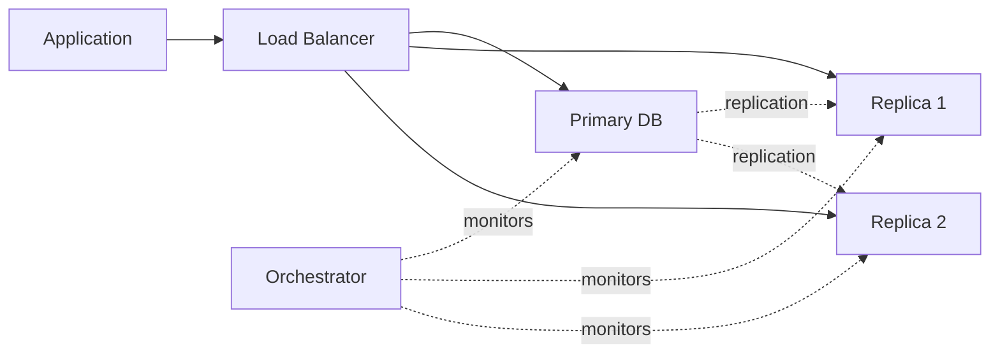

# 🗄️ Database Design & Operational Best Practices

> A comprehensive guide to database design, performance optimization, and operational excellence for the Smart Digital Food Menu project.

<!-- ✅ Features included: DB design, Table indexing, join Query, Best optimization, db connection, multi DB, read Pool, write Pool, singleton, normalization, Fallback/retry, high Availability, Backup -->

---

## 📋 Table of Contents

- [Quick Contract](#-quick-contract)
- [Table Indexing](#-table-indexing)
- [Join Queries](#-join-queries)
- [Query Optimization](#-query-optimization-best-practices)
- [DB Connection & Pooling](#-db-connection--pooling)
- [Multi-DB & Read/Write Pools](#-multi-db--readwrite-pools)
- [Singleton Pattern](#-singleton-connection-manager-pattern)
- [Normalization](#-normalization--when-to-denormalize)
- [Fallback/Retry](#-fallback--retry-resilience)
- [High Availability](#-high-availability)
- [Backup & Recovery](#-backup--recovery)
- [Operational Checklist](#-operational-checklist)
- [Security](#-security--credentials)

---

## 🎯 Quick Contract

| Aspect | Description |
|--------|-------------|
| **Inputs** | SQL queries, application workload (reads/writes), schema DDL |
| **Outputs** | Predictable latency, correct results, high availability, recoverability |
| **Error Modes** | Connection failures, long-running queries, replica lag, schema drift |

---

## 🔍 Table Indexing
<!-- ✅ Feature: Table indexing -->

### Best Practices

✅ **Use B-tree indexes** on columns in `WHERE`, `JOIN`, and `ORDER BY` clauses  
✅ **Create composite indexes** for common multi-column filters (e.g., `(category_id, food_name)`)  
✅ **Consider covering indexes** to satisfy `SELECT` queries entirely from the index  
⚠️ **Avoid over-indexing** - each index increases write cost and storage  
💡 **Use partial/filtered indexes** (where supported) for sparse columns

### Example (MySQL)

```sql
-- Composite index for category-based food searches
CREATE INDEX idx_food_category_name ON food_items (category_id, food_name);

-- Covering index for common nutrition queries
CREATE INDEX idx_food_nutrition ON food_items (food_id, food_name, category_id) 
INCLUDE (calories, protein_g, carbs_g);
```

---

## 🔗 Join Queries
<!-- ✅ Feature: join Query -->

### Optimization Guidelines

1. **Index join keys** - Ensure joined columns are indexed on the child side
2. **Use explicit JOINs** (`INNER`/`LEFT`) instead of comma joins for clarity
3. **Existence checks** - Use `EXISTS` instead of `COUNT(*)` when you only need presence
4. **Avoid cartesian products** - Be careful with large `CROSS JOIN`s

### Performance Tips

```sql
-- ✅ Good: Uses indexed join and explicit type
SELECT f.food_name, c.category_name
FROM food_items f
INNER JOIN food_categories c ON f.category_id = c.category_id
WHERE f.is_vegetarian = 1;

-- ❌ Bad: Comma join without clear relationship
SELECT f.food_name, c.category_name
FROM food_items f, food_categories c
WHERE f.category_id = c.category_id;
```

> 💡 **Pro Tip**: Run `EXPLAIN`/`EXPLAIN ANALYZE` on complex joins and look for full table scans

---

## ⚡ Query Optimization Best Practices
<!-- ✅ Feature: Best optimization -->

### Core Principles

| Strategy | Benefit |
|----------|---------|
| **Push filters down early** | Reduces dataset size early in query execution |
| **Select only needed columns** | Avoid `SELECT *` - reduces I/O and network traffic |
| **Use LIMIT for paging** | Prefer keyset pagination for large datasets |
| **Batch writes/inserts** | Reduces round-trips and transaction overhead |
| **Prepared statements** | Improves plan reuse and security |
| **Cache static data** | Cache rarely-changing data (e.g., `health_conditions`) |

### Caching Strategy

```python
# Application-level cache for static reference data
from functools import lru_cache

@lru_cache(maxsize=128)
def get_health_conditions():
    return db.execute_query("SELECT * FROM health_conditions")
```

---

## 🔌 DB Connection & Pooling
<!-- ✅ Feature: db connection -->

### Why Connection Pooling?

- ✅ Reuses existing connections instead of creating new ones per request
- ✅ Reduces connection overhead and latency
- ✅ Controls max concurrent connections to prevent database overload

### Configuration Parameters

```python
# MySQL connection pool configuration
from mysql.connector import pooling

pool_config = {
    'pool_name': 'smart_food_pool',
    'pool_size': 10,              # Max connections in pool
    'pool_reset_session': True,   # Reset session state on reuse
    'autocommit': True,
    'connect_timeout': 5,
    'use_pure': False             # Use C extension for better performance
}

connection_pool = pooling.MySQLConnectionPool(**pool_config, **MYSQL_CONFIG)

# Get connection from pool
conn = connection_pool.get_connection()
```

### Best Practices

- Set **idle timeout** to close unused connections
- Configure **max connections** based on application load
- Use **validation queries** (e.g., `SELECT 1`) before reusing connections

---

## 🌐 Multi-DB & Read/Write Pools
<!-- ✅ Features: multi DB, read Pool, write Pool -->

### Architecture Patterns

#### 1. Primary-Replica (Master-Slave)
- **One writer** (primary) + **many readers** (replicas)
- Scales read workload horizontally

#### 2. Sharding
- Partition data by `user_id`, `region`, or other key
- Enables horizontal write scaling

#### 3. Multi-Tenant
- Schema-per-tenant or shared schema with tenant_id

### Read/Write Pool Strategy

```python
class DatabasePoolManager:
    def __init__(self):
        # Write pool - routes to primary
        self.write_pool = pooling.MySQLConnectionPool(
            pool_name='write_pool',
            **PRIMARY_CONFIG
        )
        
        # Read pool - routes to replicas (with load balancing)
        self.read_pool = pooling.MySQLConnectionPool(
            pool_name='read_pool',
            **REPLICA_CONFIG
        )
    
    def get_write_connection(self):
        """Use for INSERT/UPDATE/DELETE operations"""
        return self.write_pool.get_connection()
    
    def get_read_connection(self):
        """Use for SELECT operations (may have replication lag)"""
        return self.read_pool.get_connection()
```

### ⚠️ Important Considerations

- **Replica lag**: Read replicas may be slightly behind primary
- **Transaction affinity**: Keep read-after-write in same transaction on primary
- **Failover**: Route reads to primary if all replicas are down

---

## 🎯 Singleton Connection Manager Pattern
<!-- ✅ Feature: singleton -->

### Implementation

```python
class DatabaseConnectionManager:
    _instance = None
    _lock = threading.Lock()
    
    def __new__(cls):
        if cls._instance is None:
            with cls._lock:
                if cls._instance is None:
                    cls._instance = super().__new__(cls)
                    cls._instance._initialize_pools()
        return cls._instance
    
    def _initialize_pools(self):
        """Initialize connection pools once"""
        self.write_pool = pooling.MySQLConnectionPool(...)
        self.read_pool = pooling.MySQLConnectionPool(...)
    
    def get_connection(self, pool_type='read'):
        """Get connection from specified pool"""
        if pool_type == 'write':
            return self.write_pool.get_connection()
        return self.read_pool.get_connection()
    
    def shutdown(self):
        """Gracefully close all pools"""
        # Drain connections and close pools
        pass

# Usage
db_manager = DatabaseConnectionManager()
conn = db_manager.get_connection(pool_type='write')
```

### Benefits

- ✅ Centralized configuration and monitoring
- ✅ Single point for health checks
- ✅ Graceful shutdown handling

---

## 📊 Normalization & When to Denormalize
<!-- ✅ Feature: normalization -->

### Normalization Guidelines

| Normal Form | Rule | Example |
|-------------|------|---------|
| **1NF** | Atomic values, no repeating groups | Split CSV fields into separate rows |
| **2NF** | No partial dependencies | Separate food_items and nutrition_facts |
| **3NF** | No transitive dependencies | Keep user → health_condition via junction table |

### When to Denormalize

✅ **Denormalize when**:
- Read-heavy queries where joins are too costly
- Aggregated data accessed frequently (e.g., daily nutrition totals)
- Reporting/analytics workloads

❌ **Keep normalized for**:
- Transactional tables (`users`, `food_items`, `health_conditions`)
- Data with high update frequency

### Example

```sql
-- ✅ Denormalized view for fast reporting
CREATE MATERIALIZED VIEW daily_nutrition_summary AS
SELECT 
    user_id, 
    DATE(plan_date) as date,
    SUM(calories_consumed) as total_calories,
    SUM(protein_g) as total_protein
FROM user_meal_plans ump
JOIN nutrition_facts nf ON ump.food_id = nf.food_id
GROUP BY user_id, DATE(plan_date);
```

---

## 🔄 Fallback / Retry (Resilience)
<!-- ✅ Feature: Fallback/retry -->

### Retry Strategy

```python
import time
import random

def exponential_backoff_retry(func, max_retries=3, base_delay=0.1):
    """
    Retry with exponential backoff and jitter
    """
    for attempt in range(max_retries):
        try:
            return func()
        except TransientDatabaseError as e:
            if attempt == max_retries - 1:
                raise  # Final attempt failed
            
            # Exponential backoff: 0.1s, 0.2s, 0.4s...
            delay = base_delay * (2 ** attempt)
            
            # Add jitter to prevent thundering herd
            jitter = random.uniform(0, delay * 0.1)
            
            time.sleep(delay + jitter)
            print(f"Retry attempt {attempt + 1} after {delay + jitter:.2f}s")

# Usage
result = exponential_backoff_retry(lambda: db.execute_query("SELECT ..."))
```

### Best Practices

- ✅ Use **idempotent operations** for safe retries
- ✅ Implement **circuit breaker** pattern for cascading failures
- ❌ Limit retries for **non-idempotent writes** (INSERT without unique constraint)

---

## 🚀 High Availability
<!-- ✅ Feature: high Availability -->

### HA Architecture Components



### Key Strategies

| Component | Implementation |
|-----------|----------------|
| **Automated Failover** | Use MHA, Orchestrator, or Patroni (Postgres) |
| **Health Checks** | Monitor replication lag, query latency, connection count |
| **Geo-distribution** | Place replicas in different AZs/regions |
| **DNS/Proxy Updates** | Automated traffic routing on failover |
| **Quorum Decision** | Prevent split-brain scenarios |

### Monitoring Checklist

- [ ] Primary/replica health status
- [ ] Replication lag (< 1 second target)
- [ ] Connection pool saturation
- [ ] Query latency (p50, p95, p99)
- [ ] Disk usage and I/O wait

---

## 💾 Backup & Recovery
<!-- ✅ Feature: Backup -->

### Backup Strategy

#### Full vs Incremental Backups

```bash
#!/bin/bash
# Full backup (weekly)
mysqldump --single-transaction --routines --triggers \
  --all-databases > full_backup_$(date +%Y%m%d).sql

# Incremental backup (daily) - using binary logs
mysqlbinlog --start-datetime="2024-10-10 00:00:00" \
  /var/log/mysql/mysql-bin.000001 > incremental_backup.sql
```

#### Physical Backups (Percona XtraBackup)

```bash
# Hot backup without locking tables
xtrabackup --backup --target-dir=/backup/full

# Point-in-time recovery (PITR)
xtrabackup --prepare --target-dir=/backup/full
xtrabackup --copy-back --target-dir=/backup/full
```

### Recovery Objectives

| Metric | Target | Strategy |
|--------|--------|----------|
| **RTO** (Recovery Time) | < 1 hour | Automated restore scripts |
| **RPO** (Data Loss) | < 15 minutes | Binary log archiving every 15 min |

### Best Practices

- ✅ **Test restores regularly** (monthly drill)
- ✅ **Store backups offsite** (different region/cloud)
- ✅ **Encrypt backups** at rest and in transit
- ✅ **Automate backup verification** (restore to staging)

---

## 📈 Operational Checklist

### Monitoring Metrics

| Category | Metrics |
|----------|---------|
| **Query Performance** | Slow queries (> 1s), query latency (p95/p99) |
| **Replication** | Replica lag, replication errors |
| **Connections** | Active connections, pool saturation |
| **Storage** | Disk usage, I/O wait, tablespace growth |
| **Errors** | Connection timeouts, deadlocks, lock waits |

### Alerting Rules

```yaml
# Example Prometheus alert
- alert: HighReplicationLag
  expr: mysql_replication_lag_seconds > 5
  for: 2m
  labels:
    severity: warning
  annotations:
    summary: "Replica lag exceeds 5 seconds"

- alert: ConnectionPoolSaturation
  expr: connection_pool_active / connection_pool_max > 0.9
  for: 5m
  labels:
    severity: critical
```

### Schema Migration Safety

```sql
-- ✅ Zero-downtime pattern
-- 1. Add new column (nullable)
ALTER TABLE food_items ADD COLUMN new_serving_size VARCHAR(50) NULL;

-- 2. Backfill data (batched)
UPDATE food_items SET new_serving_size = serving_size WHERE id BETWEEN 1 AND 1000;

-- 3. Make NOT NULL after backfill complete
ALTER TABLE food_items MODIFY COLUMN new_serving_size VARCHAR(50) NOT NULL;

-- 4. Drop old column
ALTER TABLE food_items DROP COLUMN serving_size;
```

---

## 🔐 Security & Credentials

### Best Practices

✅ **Never commit credentials** to source control  
✅ **Use environment variables** or secrets manager (Vault, AWS Secrets Manager)  
✅ **Principle of least privilege** - app accounts should have minimal permissions  
✅ **Rotate credentials regularly** (90-day policy)  
✅ **Enable SSL/TLS** for database connections  

### Secure Configuration

```python
# ✅ Good: Load from environment
import os

MYSQL_CONFIG = {
    'host': os.getenv('DB_HOST'),
    'user': os.getenv('DB_USER'),
    'password': os.getenv('DB_PASSWORD'),
    'database': os.getenv('DB_NAME'),
    'ssl_ca': '/path/to/ca-cert.pem',
    'ssl_verify_cert': True
}
```

---

## 🎯 Next Steps for this Project

### Immediate Actions

- [ ] Implement connection pool singleton in `database_config.py`
- [ ] Add health check endpoint to `food_menu_api.py`
- [ ] Set up automated backups (daily script + verification)
- [ ] Add retry wrapper for transient errors

### Long-term Enhancements

- [ ] Deploy read replicas for scaling
- [ ] Set up monitoring dashboards (Grafana + Prometheus)
- [ ] Implement zero-downtime migration tooling
- [ ] Add distributed tracing for query performance

---

## 📚 References & Further Reading

### Documentation
- [MySQL Performance Tuning Guide](https://dev.mysql.com/doc/refman/8.0/en/optimization.html)
- [PostgreSQL Query Optimization](https://www.postgresql.org/docs/current/performance-tips.html)
- [Connection Pooling Best Practices](https://www.percona.com/blog/2020/04/23/mysql-connection-pooling/)

### Tools
- **Query Analysis**: `EXPLAIN ANALYZE`, `pt-query-digest`
- **Monitoring**: Prometheus, Grafana, Datadog
- **Backup**: Percona XtraBackup, pg_basebackup
- **HA**: Orchestrator (MySQL), Patroni (Postgres)

---

<div align="center">

**Built with ❤️ for the Smart Digital Food Menu Project**

*For questions or contributions, please refer to the main README.md*

</div>
